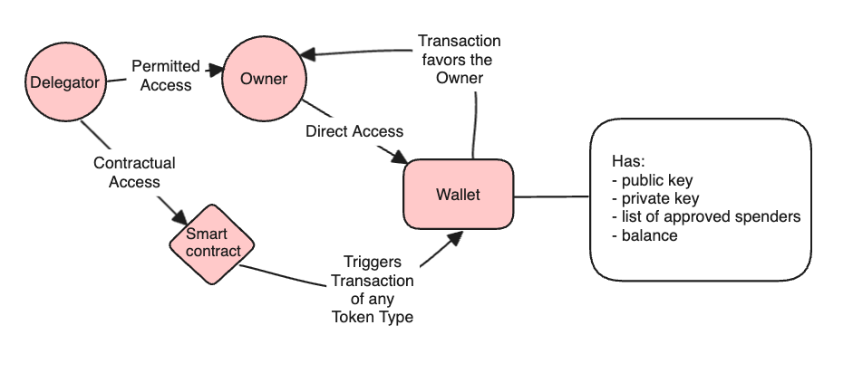

# Delegatooooor

### Granting Permission:
An account holder (the delegator) decides to grant permission to a delegate.
They create and sign a transaction that includes a `GrantPermission` instruction, specifying the delegate's account.
My program's `process_instruction` function gets called, which in turn calls Processor::process`` with the instruction data.
`Processor::process` identifies the `GrantPermission` instruction and calls `grant_permission`, 
which updates a `DelegatePermissions` account to include a new permission (e.g., `Spend`).

### Executing a Transaction:
When the delegate decides to execute a transaction on behalf of the delegator (e.g., buy tokens), 
they create and sign a transaction that includes an `ExecuteTransaction` instruction, specifying the details required for the transaction.
The `process_instruction` function is invoked again, processing the `ExecuteTransaction` instruction.
If the delegate has the appropriate `Spend` permission, as verified by the `execute_transaction` function, the program proceeds with the transaction logic.

### Revoking Permission:
If the delegator wishes to revoke the delegate's permissions, they create and sign a transaction with a `RevokePermission` instruction.
The `process_instruction` function handles this instruction similarly, removing the specified permissions from the delegate.
